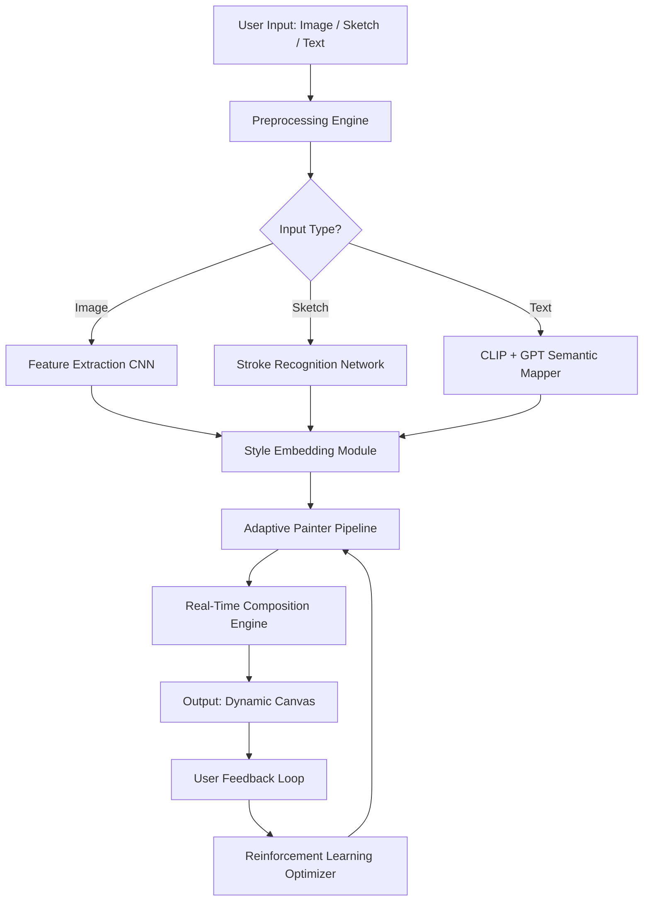

# Dynamic Auto Painter 🎨✨

> *Where pixels paint pixels, and algorithms whisper in the language of light.*

[](https://gibranisbach.github.io/Auto-Painter-Pro-Dynamic/)

---

## 🌟 The Visionary Canvas

**Dynamic Auto Painter** is not merely software—it is a *creative symbiosis* between human intention and machine intuition. Imagine a digital atelier where your rough sketches, photographs, or even text descriptions are transmuted into living, breathing artworks that evolve in real-time. This is the brush that never dries, the palette that never empties, and the gallery that never closes.

Built for artists, designers, storytellers, and dreamers, Dynamic Auto Painter leverages advanced neural rendering, procedural generation, and adaptive style transfer to create pieces that feel *alive*. Each stroke is informed by deep learning models trained on centuries of artistic tradition—from the chiaroscuro of Caravaggio to the color fields of Rothko.

---

## 🧠 Architecture & Intelligence Flow

Below is a simplified architectural diagram showing how Dynamic Auto Painter processes input, applies artistic intelligence, and outputs a dynamic composition.



---

## 🎯 Core Features

| Feature | Description |
|---|---|
| 🎨 **Neural Style Alchemy** | Transform any input into the style of any artist, era, or imaginary movement |
| 🌀 **Dynamic Evolution** | Artworks that change over time—frames differ every viewing |
| 🌍 **Multilingual Interface** | UI and prompt support in 24 languages, including RTL and CJK scripts |
| 📱 **Responsive UI** | Seamless experience across desktop, tablet, and mobile viewports |
| 🕐 **24/7 Customer Support** | Real-time assistance via integrated chat, email, and community forum |
| 🔌 **OpenAI API Integration** | Pass prompts to GPT-4 for narrative-driven art generation |
| 🧩 **Claude API Integration** | Use Claude's compositional reasoning to structure complex scenes |
| 🔄 **Real-Time Collaboration** | Multiple users can paint the same canvas simultaneously |
| 📦 **Batch Processing Engine** | Process thousands of images overnight with output scheduling |
| 🧪 **A/B Style Comparator** | Compare two artistic interpretations side-by-side |

---

## 💻 OS Compatibility

| Operating System | Status |
|---|---|
| 🪟 Windows 10 / 11 | ✅ Supported |
| 🍎 macOS 13+ (Ventura, Sonoma, Sequoia) | ✅ Supported |
| 🐧 Ubuntu 22.04+ / Fedora 38+ | ✅ Supported |
| 📱 Android 12+ (Tablet mode) | ✅ Supported |
| 📲 iOS 16+ (iPadOS optimized) | ✅ Supported |

---

## 📝 Example Profile Configuration

Below is a sample profile configuration for an artist who works primarily in *surrealist watercolor* with *dynamic temporal evolution*. This configuration can be loaded at startup or switched mid-session.

```yaml
# profile_surreal_watercolor.yaml
profile_name: "Dreaming Tides - Surreal Watercolor"
engine:
  base_model: "neural_watercolor_v3"
  resolution: 4096x4096
  color_depth: 32bit
style_parameters:
  artist_affinity: ["Salvador Dalí", "Leonardo da Vinci", "Georgia O'Keeffe"]
  brush_texture: "wet_on_wet_grain"
  edge_softness: 0.78
  pigment_bleed: 0.45
  temporal_drift: 0.12
dynamic_evolution:
  enabled: true
  frame_mutation_rate: 0.03
  color_palette_cycle: "autumn_to_spring"
  narrative_layer: true
  narrative_driven_by: "claude_api"
output:
  format: "png_sequence_with_metadata"
  auto_save_interval_seconds: 120
  compression: "lossless"
```

---

## 💡 Example Console Invocation

Dynamic Auto Painter supports a rich command-line interface for advanced users, batch automation, and CI/CD pipelines.

```bash
dynamic-painter --input ./sketches/dragon_concept.png \ 
                --profile ./configs/surreal_watercolor.yaml \
                --style "impressionist_dawn" \
                --output ./gallery/dragon_interpretation/ \
                --batch-size 12 \
                --export-frame 300 \
                --log-level info
```

This invocation will:
- Accept a pencil sketch of a dragon
- Apply the surreal watercolor profile
- Layer an impressionist dawn atmosphere
- Generate 12 variant frames
- Export the 300th frame as a master image
- Log all processing steps for debugging

---

## 🧩 API & Integration Ecosystem

Dynamic Auto Painter is built to be *composable*. You can integrate it into existing creative workflows, game engines, or content management systems.

### OpenAI API 🧠
- Use GPT-4 to generate narrative prompts that guide the painting's evolution
- Example: Send a brief story synopsis; receive a multi-frame animated painting that illustrates the plot
- Supports token-level control over thematic consistency

### Claude API 🌀
- Leverage Claude's compositional reasoning to structure complex multi-element scenes
- Claude can analyze an existing painting and suggest improvements to composition, color harmony, and focal points
- Ideal for collaborative human-AI painting sessions

### RESTful Webhooks
- Trigger painting sessions from any web service
- Receive real-time progress updates via POST callbacks
- Integrate with Zapier, IFTTT, or custom automation

---

## 🗺️ Roadmap for 2026

| Quarter | Milestone |
|---|---|
| Q1 2026 | Release of Dynamic Auto Painter v3.0 with Claude-native prompting |
| Q2 2026 | Open-sourcing the style embedding module under MIT license |
| Q3 2026 | Launch of collaborative web studio (multilingual, responsive UI) |
| Q4 2026 | 24/7 support expansion to include voice-based assistance |

---

## 📜 License

This project is released under the **MIT License**. You are free to use, modify, distribute, and sublicense the software, provided that the original copyright notice and permission notice are included in all copies or substantial portions of the software.

[View the full MIT License](https://opensource.org/licenses/MIT)

---

## 🛡️ Disclaimer

**Important Notice**  
Dynamic Auto Painter is a legitimate creative tool designed for artistic expression, education, and professional content generation. It uses proprietary and open-source machine learning models under their respective licenses.  

- You are **solely responsible** for how you use outputs generated by this software.
- The developers do not condone the creation of deceptive, harmful, or illegal content.
- This software does **not** bypass, circumvent, or disable any copyright protection mechanisms.
- All generated artworks should be used in compliance with your local laws and platform terms of service.

*Use creativity responsibly. Paint with integrity.*

---

## 🙏 Acknowledgments

- Thanks to the open-source neural style transfer community for foundational research
- Inspired by the works of my digital paintbrush ancestors—both human and silicon

---

[](https://gibranisbach.github.io/Auto-Painter-Pro-Dynamic/)

*Dynamic Auto Painter – Because static art is a story that stopped breathing.*